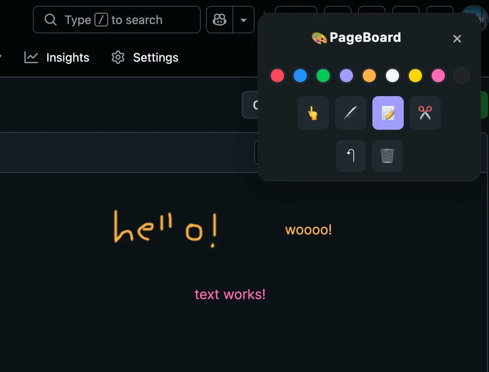
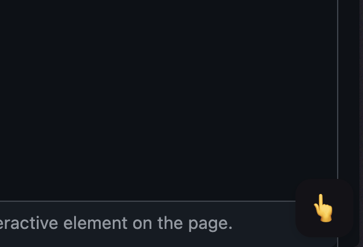

# ✏️ Pageboard

**Draw on any webpage, instantly.**

Pageboard is a lightweight Chrome extension that overlays a drawing canvas on top of any website — so you can sketch, annotate, highlight, and think visually without leaving your browser.

---

## Preview

---

## Why Pageboard?

Sometimes you just need to **draw something out**. Whether you're solving a layout problem on Google Slides, marking up a mockup, jotting a quick note during a meeting, or diagramming an idea mid-research — switching to a separate app breaks your flow.

Pageboard puts the canvas where you already are.

---

## Use Cases

- **Google Slides** — draw directly over your presentation to sketch diagrams, mark up slide layouts, or plan edits before making them
- **Websites & dashboards** — annotate data, circle things that need fixing, or sketch UI feedback in context
- **Practice quizzes & problem sets** — circle answer choices, cross out wrong options, or annotate questions as you work through them — drawings stay anchored to the page as you scroll
- **Video calls & screen shares** — draw attention to specific parts of the screen live
- **Quick notes** — jot a formula, doodle a diagram, or map out a quick thought without opening another app
- **Design review** — mark up Figma embeds, Notion pages, or any web-based design tool

---

## Features

- 🖊️ Freehand drawing on any webpage
- 🎨 Color picker and brush size controls
- 🧹 Eraser and clear canvas options
- 🔁 Toggle the canvas on/off without losing your drawing
- 📌 Drawings scroll with the page — annotations stay anchored to the content you drew on
- ⚡ Zero config — works immediately after install

---

## Installation

1. Clone or download this repository
2. Open Chrome and navigate to `chrome://extensions/`
3. Enable **Developer Mode** (toggle in the top right)
4. Click **Load unpacked**
5. Select the root folder of this repository

The extension icon will appear in your toolbar. Click it to activate the drawing canvas on any tab.

---

## Limitations

> **PDF files in Chrome are not supported.**
> On PDFs, drawings do not scroll with the page content — annotations stay fixed to the viewport while the PDF moves beneath them. As a workaround, download the PDF and open it in an external viewer, or use a web-based PDF viewer like Adobe Acrobat Online or Chromium's own PDF annotator.
>
> On all regular websites, drawings scroll with the page as expected.

---

## How It Works

Pageboard injects a transparent `<canvas>` element over the current page using a Chrome content script. Mouse events are captured by the canvas while the toggle is active, and the underlying page remains fully intact beneath it. Toggling the extension off restores normal page interaction without clearing your drawing.

---

## Contributing

Pull requests are welcome. If you find a site where the canvas behaves unexpectedly, open an issue with the URL and a description of what happened.

---

## License

MIT
